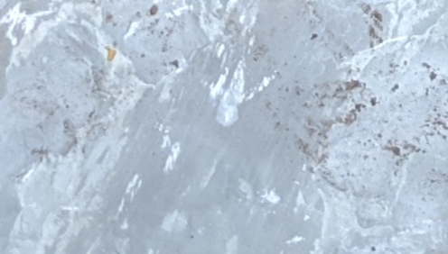

# Patio Rocks

Because nerds can't just *do* yard work.

## Background

We're making this patio thing in our backyard out of rocks from this stone yard around the corner.

The rocks cost `$0.20` per pound (sweet deal!), and my wife bought `500` pounds worth of rocks on Saturday morning. (She lifted them all into a wheelbarrow and then again into the car, all by herself! What a she-hulk! Hubba hubba!)

We need more rocks to finish this thing up, the question is how many more?

## Nerd Sleuthing

### Image

Here's a picture I took of the patio rocks we've put down so far:


### Crop

I manually cropped the image to be JUST the area I care about using the `Preview` app on OSX (I used the `Smart Lasso` tool, woof!)


Note: Ignore our lemon tree potter. That thing was too heavy to lift very far so we just left it there while we did the work. Please excuse the crudity of this model...


### Get "brightness" of image pixels

I wrote [a script](image_color_values.py) to get the average "brightness" of each pixel using [the formula [(red + green + blue) / 3](https://stackoverflow.com/a/6449381) and outputted the results to a file in JSON format.

```
$ ./image_color_values.py assets/cropped.png > assets/values.json
```

Note: I zipped up `assets/values.json` into `assets/values.json.tgz` for this repo because it was WAY too big

### Histogram

From here I used this histogram script to draw a histogram of the values so I could determine a "brightness" threshold, the idea being that everything below (darker than) this threshold would be considered dirt, and everything above (brighter than) this threshold would be considered stone.

```
$ ./histogram.py assets/values.json --title "Patio Rocks/Dirt Pixel Lightness Histogram"
```


### Threshold

I determined a good threshold of light (stone) to dark (dirt) to be `~155`-ish

### Check values

How many of the values are above/below our threshold?

```
$ jq '.counts | map(select(. <= 155)) | length' values.json 
4747333
jq '.counts | map(select(. > 155)) | length' values.json 
2532133
```

([jq](https://stedolan.github.io/jq/) to the rescue)

`4,747,333` "dark" pixels (dirt)
`2,532,133` "light" pixels (stone)

```
2,532,133 / (2,532,133 + 4,747,333)

~= 35%
```

So, the area pictured is roughly a third full of stones.

### Stone to Dirt Ratio

But what's our ideal stone : dirt ratio?

Surely we don't want the entire thing covered by stone, we'd like to have some space between the stones. Maybe we'll put smaller rocks in there. Or maybe sand. I just don't know yet.

Either way, I took a crop of the cropped picture to see if I could make a guess at how much dirt per stone we should have:


So first I got the "brightness" values:

```
$ ./image_color_values.py assets/cropped-highlight.png > assets/values-highlight.json
```

And obviously I had to make a histogram:


And with the same threshold of `155` here are the numbers:

```
$ jq '.counts | map(select(. <= 155)) | length' values-highlight.json 
280712
$ jq '.counts | map(select(. > 155)) | length' values-highlight.json 
557439
```

`280,712` "dark" pixels (dirt)
`557,439` "light" pixels (stone)

```
557,439 / (280,712 + 557,439)

~= 67%
```

So in our final area we'd like two thirds of it to be stone and one third to be dirt.

### Sanity Check

This 1/3 dirt value feels a bit high to me. Let's just make sure we're seeing what we think we're seeing.

I took a crop of mostly stone and a crop of mostly dirt. Let's analyze them in the same way...


#### Stone



```
$ ./image_color_values.py assets/stone.png > assets/values-stone.json
$ ./histogram.py assets/values-stone.json
```


#### Dirt


```
$ ./image_color_values.py assets/dirt.png > assets/values-dirt.json
$ ./histogram.py assets/values-dirt.json
```


Phew!

### Bringing it all together

Based on all of the above...

`~35%` of the area is currently stone.

We want the area to be roughly `67%` stone.

```
67 - 35 = 32

32 / 35 ~= 0.91
```

so we need `~91%` of how much stone we got before

```
0.91 * 500 = 455

455 * 0.2 = 91
```

Cool, so we'll need `455` more pounds, which should cost about `91` bucks.

My wife said we'd probably need about this much, but I couldn't help it, I just had to find out.

As always, I should have just taken her word for it, but instead here I am, typing on my computer at 1 in the morning.


## Resources

- PNG / alpha channel
  - https://www.w3.org/TR/PNG-DataRep.html
- PIL/PILLOW
  - https://pillow.readthedocs.io/en/stable/handbook/tutorial.html
  - https://pillow.readthedocs.io/en/stable/reference/Image.html#PIL.Image.Image.load
- SO posts for reading image pixels using PIL
  - Pixel RGB values https://stackoverflow.com/a/138260
  - "brightness": https://stackoverflow.com/a/6449381
